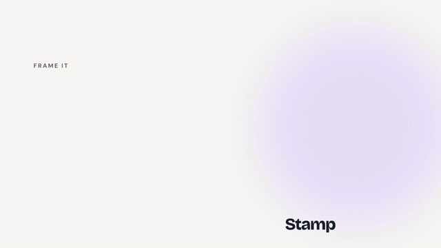

<div align="center">


# CamArt

**A tiny daily camera that turns moments into stickers.**

Frame it, snap it, style it. Your days fill up with little collectibles: stamps, polaroids, clovers, hearts.
Offline, private, no account.

[**⬇ Download for Android (APK)**](https://github.com/Itsmedexexplorer/CamArt/releases/latest/download/CamArt.apk) &nbsp;·&nbsp;
[**▶ Watch the demo**](https://github.com/Itsmedexexplorer/CamArt/releases/latest/download/CamArt-demo.mp4)

<br />

<a href="https://github.com/Itsmedexexplorer/CamArt/releases/latest/download/CamArt-demo.mp4">
  
</a>

<sub>Click the preview for the full 1-minute demo with sound.</sub>

<br /><br />


</div>

---

## What it does

- **Shoot straight into a frame.** Ten die-cut shapes (stamp, polaroid, clover, flower, blossom, scallop, star, heart, ticket, bubble) on a rotary dial around the shutter. Spin it and feel each detent.
- **Style it.** 13 film-inspired filters with a pixel-dissolve transition, grain, edge colours, a little label, free text you can drag anywhere, and an optional date stamp.
- **Lift.** One tap cuts the subject out of the photo (a person, pet or object) and turns it into a sticker with a white die-cut edge. Runs on-device.
- **Stickers that feel physical.** The finished sticker tilts in 3D as you move your phone.
- **Your days, collected.** A sticker board grouped by day, search by note, shape, filter or date ("yesterday", "june"), and a calendar with your streak and an "On this day" memory.
- **Share anywhere.** Share or copy a sticker, or send your 30 newest to WhatsApp as a real sticker pack.
- **Home-screen widget** that shows today's sticker.
- **Back up and restore** everything as a single ZIP file.
- Light and dark mode, haptics throughout, Reduce Motion respected, screen-reader labels.

## Try it

**Android:** download [`CamArt.apk`](https://github.com/Itsmedexexplorer/CamArt/releases/latest/download/CamArt.apk) on your phone, open it, and allow installing from your browser when Android asks. It's about 64 MB and needs a 64-bit phone (anything from the last several years).

**iOS:** not published yet. You can run it from source (below) with a development build.

> Lift needs Google Play services. The first time you use it, your phone downloads the model in the background, so give it a minute if it says it's getting ready.

## Privacy

Photos never leave your phone unless you share or export them. There's no account, no cloud and no analytics. Backups are plain ZIP files you control.

## Built with

[Expo](https://expo.dev) SDK 57 · React Native · Expo Router · [React Native Skia](https://shopify.github.io/react-native-skia/) (sticker rendering, filters, shaders) · Reanimated 4 + Gesture Handler · expo-camera · expo-file-system · Phosphor icons · Bricolage Grotesque and DM Sans.

Native features live in a local Expo module, [`modules/camart-native`](modules/camart-native):

| Feature | Android | iOS |
| --- | --- | --- |
| Lift (background removal) | ML Kit Subject Segmentation | Vision foreground instance mask |
| WhatsApp sticker pack | ContentProvider + `ENABLE_STICKER_PACK` | Pasteboard pack |
| Home-screen widget | AppWidgetProvider | WidgetKit ([`targets/widget`](targets/widget)) |

## Run from source

```bash
git clone https://github.com/Itsmedexexplorer/CamArt.git
cd CamArt
npm install
npx expo start
```

Most of the app runs in **Expo Go**. Lift, the WhatsApp pack and the widget need a development build:

```bash
npx eas-cli@latest build --platform android --profile development
```

Other useful commands:

```bash
npx expo lint          # lint
npx tsc --noEmit       # typecheck
node scripts/check-backup.mjs && node scripts/check-journal.mjs   # backup + streak self-checks
```

The release APK is built with `npx eas-cli@latest build --platform android --profile preview` (arm64 only, to keep it small).

## Project layout

```
src/app/          screens (Expo Router): camera, memories, calendar, settings, editor, memory detail
src/lib/          sticker renderer, storage, backup format, streak logic, native bridges
src/ui/           shared components: shape dial, tab bar, dialogs, loaders, intro
modules/          camart-native (Kotlin + Swift)
targets/widget/   iOS widget
plugins/          config plugins
```

---

<div align="center">
<sub>Made with Expo. One small moment a day.</sub>
</div>
